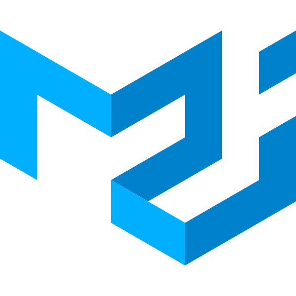

<h1 align="center">Hi 👋, I'm Abolfazl Panbehkar</h1>

<h3 align="center">A passionate frontend developer 🤩😎</h3>

<ul>
  <li>🌱 I'm always <b>learning</b></li>
  <li>📝 Read my last article <a href="https://panbehkar.com/blog/5-practical-css-variables-tricks-and-tips" target="_blank">5 Practical CSS variables tricks and tips</a></li>
  <li>💼 Know about my experiences <a href="https://panbehkar.com/about" target="_blank"> About me</a></li>
  <li>📫 How to reach me <b>abolfazl.panbehkar@gmail.com</b></li>
</ul>

<h3 align="left">Connect with me:</h3>

  
  
  

<h3 align="left">Languages and Tools:</h3>

  
  
  
  
  
  
  
  
  
  
  
   
    
  
  
  
  
  
  
  
  
  
  
  

<h3 align="left">GitHub Stats:</h3>

  

  

