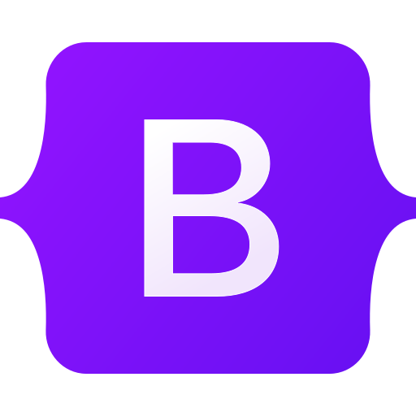
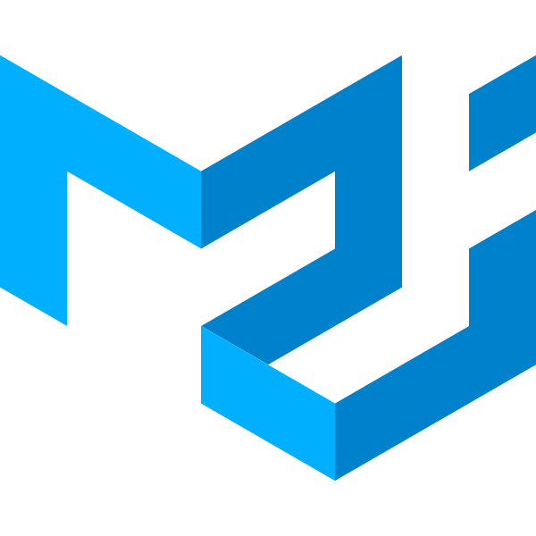
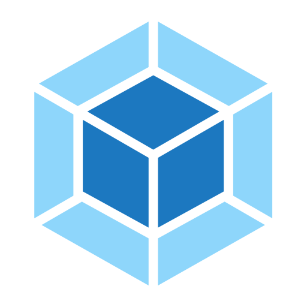
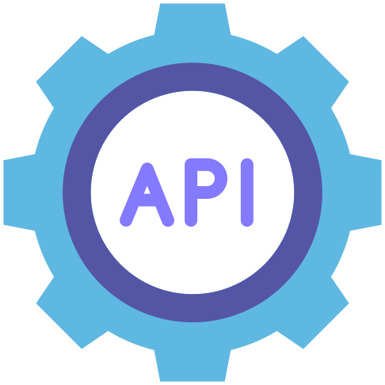
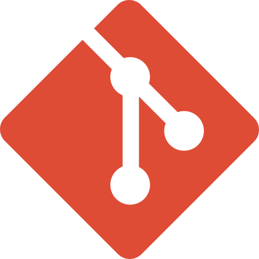

<h1 align="center">Hi 👋, I'm Abolfazl Panbehkar</h1>

<h3 align="center">A passionate frontend developer 🤩😎</h3>

<ul>
  <li>🌱 I'm always <b>learning</b></li>
  <li>
    📝 Read my last article
    <a
      href="https://panbehkar.com/blog/5-practical-css-variables-tricks-and-tips"
      target="_blank"
    >
      5 Practical CSS variables tricks and tips
    </a>
  </li>
  <li>
    💼 Know about my experiences
    <a href="https://panbehkar.com/about" target="_blank"> About me </a>
  </li>
  <li>
    📫 How to reach me
    <a href="mailto:abolfazl.panbehkar@gmail.com" target="_blank">
      abolfazl.panbehkar@gmail.com
    </a>
  </li>
</ul>

<h3 align="left">Connect with me:</h3>

  
  
  

### Languages and Tools:

### GitHub Stats:

